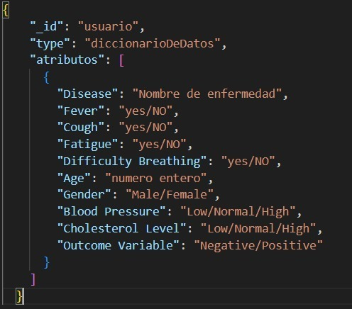
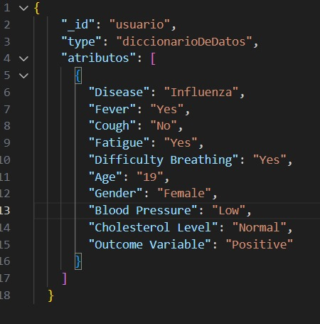

# PD03_04 Modelado de Datos
# E04:	CouchDB Integrantes: Rogerio Emmanuel Canto Romero, Diego Enrique Duran Pavia, Raul Alberto Kumul Varguez.

# Haciendo	uso	de	un	repositorio	de	Github,	documente	lo	siguiente:
# a. Agregar el	archivo	del	dataset 
Se puede localizar en nuestro repositorio  "PD03_04" el dataset original por el nombre de:
"Disease_symptom_and_patient_profile_dataset.csv" 

# El dataset:
El dataset fue rescatado de Kaggle:

Se decidió utilizar este archivo en específico, ya que se notaba bastante ordenado y comprensible, y consideramos que sería fácil trabajar con él.

Como sabemos los archivos CSV son un tipo de documento en formato abierto sencillo para representar datos en forma de tabla, en las que las columnas se separan por comas y las filas por saltos de línea, pero una de las particularidades de nuestra base de datos "Couch DB" es que solo maneja archivos en formato JSON, por lo que el primer paso es convertir el dataset de csv a JSON

# Convertin a JSON

Usando La herramienta de inteligencia artificial de BING se generó un código en Python que nos permite transformar un archivo de Excel a JSON (el código se puede encontrar en nuestro repositorio por el nombre de "Excel-To-JSON.py"), como habíamos mencionado anteriormente nuestro data set se encuentra en formato csv, pero por las propiedades del mismo puede ser interpretado como un Excel, por lo que el código nos fue útil para conseguir que nuestro dataset este en formato JSON y listo para ser subido a nuestra base de datos (En CouchDB).

# b. Descripción	del	dataset

El Data set cuenta con los datos de 349 pacientes, dentro de los que se recopila la siguiente información:

Enfermedad: El nombre de la enfermedad o condición medica.

Fiebre: Indica si el paciente tiene o no fiebre.

Tos: Indica si el paciente tiene o no tos.

Fatiga: Indica si el paciente presenta o no fatiga.

Dificultad para respirar: Indica si el paciente tiene o no dificultades para respirar.

Edad: La edad en años del paciente.

Sexo: Masculino o femenino.

Presión arterial: Indica el nivel de la presión arterial del paciente.

Nivel de colesterol: Nivel de colesterol del paciente.

Resultado del análisis: Muestra si el paciente está o no enfermo de lo que se esperaba.

# c. Descripción	del	diccionario	de	datos	del	dataset
Debido a que trabajamos con CouchDB y este tiene bastante encapsulamiento y modularidad, no hay una forma específica para agregar los documentos, a continuación mostraremos un ejemplo del formato que llevan los JSON de nuestra DB y un ejemplo tomada de la misma DB

# d. Descripción	del	modelado	del	dataset	según	la	BD	NoSQL
Estructura de Documentos JSON:

•	Cada registro del dataset es en un documento JSON individual en CouchDB.

•	Los campos del dataset (como enfermedad, síntomas, edad, género, etc.)
 son claves en el documento JSON y el valor es el dato asociado a una clave 
específica.

Diseño de Documentos:
Cada paciente tiene un documento único que contiene toda su información, 
incluyendo los síntomas, diagnósticos y demás detalles relevantes.

ID de Documento Único:
Cada documento en CouchDB tiene un ID único. Utiliza un identificador 
generado automáticamente.
# e. Descripción	de	la	BD	NoSQL	y	las	herramientas	que	se	utilizaron.
La base de datos NoSQL se centra en la relación entre varias enfermedades, los síntomas asociados, y los perfiles de pacientes. Es una herramienta valiosa para el análisis de datos en el campo de la medicina. 

•	Formato de Datos: Al estar en JSON, la base de datos es fácilmente accesible y manipulable, lo que permite realizar análisis y filtrar información de manera eficiente.

•	Potencial de Análisis Estadístico y de Datos: La estructura de la base de datos facilita la realización de análisis estadísticos, como la identificación de tendencias, correlaciones entre síntomas y enfermedades, y la evaluación de factores de riesgo.

Por otro lado, para la creación de esta base de datos se utilizó un programa en Python (subidor.py) para subir los documentos en formato JSON a la base que está en CouchDB, el código fue generado por la inteligencia artificial Bing, únicamente se modificaron la dirección de origen archivo que se va a subir y la dirección de destino a la base de datos. También se utilizo Visual Studio Code para realizar dichos cambios y verificar que todo funcione de manera adecuada.

# f. Descripción	de	la	importación	de	sus	datos.
Para esto ya debimos de haber creado nuestra base de datos.
Después, como ya habíamos comentado en el inciso e, generamos un código con la inteligencia artificial Bing, una vez generado el código y lo modificamos para poner nuestro usuario y contraseña de la base de datos procedemos a correr el codigo en el Visual studio code. 

Esperamos un momento a que se suban los archivos y luego observamos nuestra base de datos con los archivos.

# g. Definir	 y	 describir	 al	 menos	 5	 sentencias	 para	 cada	 una	 de	 las	
# operaciones	CRUD (Create,	Read,	Update,	Delete) en	la	BD.	
Sentencias CRUD aplicadas a nuestra base de datos.

Antes de realizar cualquier sentencia CRUD hay que colocar la siguiente parte de código:

import requests
from requests.auth import HTTPBasicAuth

Configuración de la conexión a CouchDB
base_url = 'http://localhost:5984/'
db_name = 'enfermedades' #(nombre de la base de datos)
user = 'Admin' #(nombre del Usuario de CouchDB)
password = 'Tr@nsp0rtar' #(contrasena de CouchDb)

Autenticación
auth = HTTPBasicAuth(user, password)

Nota: este fragmento código está preparando todo lo necesario para establecer una conexión autenticada con una base de datos CouchDB local, utilizando la autenticación básica HTTP. La conexión en sí (por ejemplo, realizar una solicitud GET o POST) no se realiza en este fragmento de código, pero este sería el setup inicial para cualquier interacción con la base de datos.

# Sentencia CREATE:
#
# Crear  un nuevo documento en la base de datos
#
data = {
  "Disease": "Coronavirus",
  "Fever": "Yes",
  "Cough": Yes",
  "Fatigue": "Yes",
  "Difficulty Breathing": "Yes",
  "Age": 23,
  "Gender": "Female",
  "Blood Pressure": "Low",
  "Cholesterol Level": "Normal",
  "Outcome Variable": "Positive"
}
create_response = requests.post(f'{base_url}{db_name}', json=data, auth=auth)
print('Crear:', create_response.json())
#
# Crear un nuevo documento con atributos diferentes al resto:
#
data={
  "DiagnosisDate": "2023-12-04",
  "Symptoms": "Headache",
  "TreatmentPlan": "Medication and Rest",
  "FollowUpRequired": “true”,
  "Doctor": "Dr. Smith",
  "ClinicLocation": "Downtown Medical Center"
}
create_response = requests.post(f'{base_url}{db_name}', json=data, auth=auth)
print('Crear:', create_response.json())
#
# Crear un documento con un atributo distinto de síntomas:
#
data={
    "Disease": "Dengue",
  "Fever": "Yes",
  "Cough": No",
  "Fatigue": "Yes",
  "Difficulty Breathing": "Yes",
  "Age": 40,
  "Gender": "Female",
  "Blood Pressure": "Low",
  "Cholesterol Level": "Normal",
"Alcohol Consumption": "Moderate",
 "Outcome Variable": "Positive"
}
create_response = requests.post(f'{base_url}{db_name}', json=data, auth=auth)
print('Crear:', create_response.json())
#
# Crear un documento con un arreglo de enfermedades:
#
data = {
  "Disease": ["Diabetes”, “Ébola", “Cancer”],
  "Fever": "Yes",
  "Cough": No",
  "Fatigue": "Yes",
  "Difficulty Breathing": "Yes",
  "Age": 40,
  "Gender": "Male",
  "Blood Pressure": "Hight",
  "Cholesterol Level": "Hight",
  "Outcome Variable": "Positive"
}
create_response = requests.post(f'{base_url}{db_name}', json=data, auth=auth)
print('Crear:', create_response.json())
#
# Crear un documento sin el atributo "Blood Pressure":
#

data={
  "Disease": "Hypothetical Disease",
  "Fever": "Yes",
  "Cough": "No",
  "Fatigue": "Yes",
  "Difficulty Breathing": "No",
  "Age": 40,
  "Gender": "Male",
  "Cholesterol Level": "High",
  "Outcome Variable": "Positive"
}
create_response = requests.post(f'{base_url}{db_name}', json=data, auth=auth)
print('Crear:', create_response.json())

#
# Sentencias Read:
#
# Obtener un documento especifico con su ID:
#
doc_id = 7f9cd9994bb9f862b1a724af5b0ba92c
response = requests.get(f'{base_url}{db_name}/{doc_id}', auth=auth)
print('Leer:', response.json())
#
# Leer todos los documentos (solo id’s) de la base de datos (usando _all_docs):
#
response = requests.get(f'{base_url}{db_name}/_all_docs', auth=auth)
print('Todos los documentos:', response.json())
#
# Leer documentos filtrados por un campo específico (por ejemplo, enfermedad):
#
enfermedad = 'Influenza'
query = {"selector": {"Disease": enfermedad}}
response = requests.post(f'{base_url}{db_name}/_find', json=query, auth=auth)
print('Documentos con enfermedad específica:', response.json())
#
# Leer documentos de pacientes de un rango de edad específico:
#
query = {"selector": {"Age": {"$gte": 20, "$lte": 40}}}
response = requests.post(f'{base_url}{db_name}/_find', json=query, auth=auth)
print('Pacientes en un rango de edad:', response.json())

#
# Leer documentos con un nivel específico de presión arterial:
#
blood_pressure = 'High'
query = {"selector": {"Blood Pressure": blood_pressure}}
response = requests.post(f'{base_url}{db_name}/_find', json=query, auth=auth)
print('Documentos con presión arterial alta:', response.json())

#
# Sentencia Update:
#
# Actualizar el campo 'Gender' de un documento específico:
#
doc_id = ‘7f9cd9994bb9f862b1a724af5b0bd3e2'
response = requests.get(f'{base_url}{db_name}/{doc_id}', auth=auth)
doc = response.json()
doc['Gender'] = 'Male'  # Cambiar el género
response = requests.put(f'{base_url}{db_name}/{doc_id}', json=doc, auth=auth)
print('Actualizar género:', response.json())
#
# Añadir un nuevo atributo a un documento:
#
doc_id = ''7f9cd9994bb9f862b1a724af5b0bd3e2''
response = requests.get(f'{base_url}{db_name}/{doc_id}', auth=auth)
document = response.json()
document['Recovery Time'] = '14 days'  # Añadir nuevo atributo
response = requests.put(f'{base_url}{db_name}/{doc_id}', json=document, auth=auth)
print('Añadir atributo Recovery Time:', response.json())
#
# Actualizar el campo 'Blood Pressure' de un documento:
#
doc_id = ''7f9cd9994bb9f862b1a724af5b0bd3e2''
response = requests.get(f'{base_url}{db_name}/{doc_id}', auth=auth)
doc = response.json()
doc['Blood Pressure'] = 'Normal'  # Cambiar la presión arterial
response = requests.put(f'{base_url}{db_name}/{doc_id}', json=doc, auth=auth)
print('Actualizar presión arterial:', response.json())

#
# Actualizar múltiples campos en un documento:
#
doc_id = '7f9cd9994bb9f862b1a724af5b0bd3e2'
response = requests.get(f'{base_url}{db_name}/{doc_id}', auth=auth)
doc = response.json()
doc['Fever'] = 'No'
doc['Cough'] = 'Yes'
response = requests.put(f'{base_url}{db_name}/{doc_id}', json=doc, auth=auth)
print('Actualizar fiebre y tos:', response.json())
#
# Actualizar el campo 'Outcome Variable' de un documento:
#
doc_id = '7f9cd9994bb9f862b1a724af5b0bd3e2'
response = requests.get(f'{base_url}{db_name}/{doc_id}', auth=auth)
doc = response.json()
doc['Outcome Variable'] = 'Negative'  # Cambiar la variable de resultado
response = requests.put(f'{base_url}{db_name}/{doc_id}', json=doc, auth=auth)
print('Actualizar variable de resultado:', response.json())
#
# Sentencia Delete:
#

# Eliminar un documento específico por ID:
#
doc_id = '7f9cd9994bb9f862b1a724af5b0bd3e2'
response = requests.get(f'{base_url}{db_name}/{doc_id}', auth=auth)
doc_rev = response.json()[‘5-e650b7bd9b2ef2d88104e1f948737754’]
response = requests.delete(f'{base_url}{db_name}/{doc_id}?rev={doc_rev}', auth=auth)
print('Eliminar documento 1:', response.json())
#
# Eliminar un atributo especifico de un documento:
#
doc_id = ''7f9cd9994bb9f862b1a724af5b0bd3e2''
response = requests.get(f'{base_url}{db_name}/{doc_id}', auth=auth)
document = response.json()
if 'Blood Pressure' in document:
    del document['Blood Pressure']
    response = requests.put(f'{base_url}{db_name}/{doc_id}', json=document, auth=auth)
    print('Eliminar atributo Blood Pressure:', response.json())
else:
    print('El documento no tiene el atributo Blood Pressure')

#
# Eliminar el diseño de un documento:
#
design_doc_id = '_design/diseno1'
response = requests.get(f'{base_url}{db_name}/{design_doc_id}', auth=auth)
design_doc = response.json()
if response.status_code == 200:
    doc_rev = design_doc['_rev']
    response = requests.delete(f'{base_url}{db_name}/{design_doc_id}?rev={doc_rev}', auth=auth)
    print('Eliminar diseño de documento:', response.json())
else:
    print('Diseño de documento no encontrado o error al obtenerlo.')

#
# Eliminar la base de datos: 
#
response = requests.delete(f'{base_url}{db_name}', auth=auth)
print('Eliminar base de datos:', response.json())
#
# Eliminar los atributos de un documento (excepto 'id' y 'rev')
#
doc_id = ''7f9cd9994bb9f862b1a724af5b0bd3e2''
response = requests.get(f'{base_url}{db_name}/{doc_id}', auth=auth)
document = response.json()
#
# Conservar solo los campos '_id' y '_rev'
minimal_document = {'_id': document['_id'], '_rev': document['_rev']}
response = requests.put(f'{base_url}{db_name}/{doc_id}', json=minimal_document, auth=auth)
print('Dejar documento casi vacío:', response.json())
