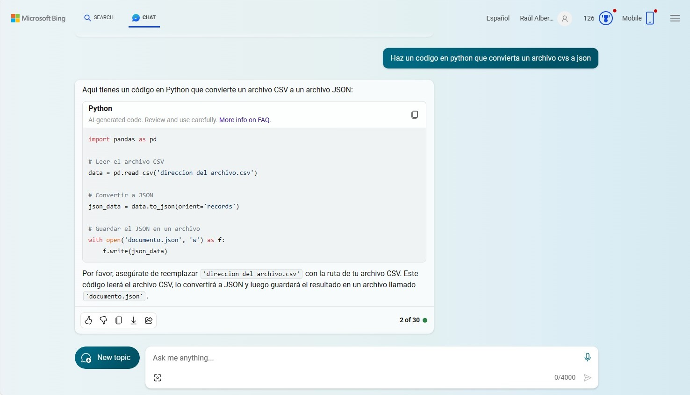

# PD03_04 Modelado de Datos
# E04:	CouchDB Integrantes:Rogerio Emmanuel Canto Romero, Diego Enrique Duran Pavia, Raul Alberto Kumul Varguez

# Haciendo	uso	de	un	repositorio	de	Github,	documente	lo	siguiente:
# a. Agregar el	archivo	del	dataset 
Se puede localizar en nuestro repositorio  "PD03_04" el dataset original por el nombre de:
"Disease_symptom_and_patient_profile_dataset.csv" 

# El data set:
El dataset fue rescatado de Kaggle 

Se decidio utilizar este archivo en especifico, ya que se notaba bastante ordenado y comprensible, y consideramos que seria facil trabajar con el.

como sabemos los archivos CSV son un tipo de documento en formato abierto sencillo para representar datos en forma de tabla, en las que las columnas se separan por comas y las filas por saltos de línea, pero una de las particularidades de nuestra base de datos "Couch DB" es que solo maneja archivos en formato JSON, por lo que el primer paso es convertir el dataset de csv a json

# Convertin a JSON

Usando La herramienta de inteligencia artificial de BING se genero un codigo en python que nos permite transformar un archivo de Excel a json (el codigo se puede encontrar en nuestro repositorio por el nombre de "Excel-To-JSON.py"), como habiamos mencionado anteriormente nuestro data set se encuentra en formato csv, pero por las propiedades del mismo puede ser interpretado como un excel, por lo que el codigo nos fue útil para conseguir que nuestro dataset este en formato JSON y listo para ser subido a nuestra base de datos (En CouchSB).

# b. Descripción	del	dataset

El Data set cuanta con los datos de 349 pacientes, dentro de los que se recopila la siguiente informacion:

Enfermedad: El nombre de la enfermedad o condicion medica.

Fiebre: Indica si el paciente tiene o no fiebre.

Tos: Indica si el paciente tiene o no tos.

Fatiga: Indica si el paciente presenta o no fatiga.

Dificultad para respirar: Indica si el paciente tiene o no dificultades para respirar.

Edad: La edad en años del paciente.

Sexo: Masculino o femenino.

Presion arterial: Indica el nivel de la presion arterial del px.

Nivel de colesterol: Nivel de colesterol del paciente.

Resultado del analisis: Muestra si el paciente esta o no enfermo de lo que se esperaba.

# c. Descripción	del	diccionario	de	datos	del	dataset

# d. Descripción	del	modelado	del	dataset	según	la	BD	NoSQL

# e. Descripción	de	la	BD	NoSQL	y	las	herramientas	que	se	utilizaron.

# f. Descripción	de	la	importación	de	sus	datos.

# g. Definir	 y	 describir	 al	 menos	 5	 sentencias	 para	 cada	 una	 de	 las	
# operaciones	CRUD (Create,	Read,	Update,	Delete) en	la	BD.	
